# Pipeline de Dados E-commerce para Análise de Vendas

Este projeto implementa um pipeline de Extração, Transformação e Carga (ETL) para processar dados de vendas de produtos de um e-commerce. Os dados são extraídos de uma API, armazenados em um formato bruto no MongoDB, transformados, e então carregados em uma tabela de staging no PostgreSQL. Subsequentemente, um Data Warehouse com um modelo Star Schema é populado a partir da tabela de staging para permitir análises de Business Intelligence.

Este projeto foi desenvolvido como um exercício prático e peça de portfólio, demonstrando habilidades em engenharia de dados, Python, SQL, MongoDB, PostgreSQL, Docker e modelagem de dados.

```mermaid
flowchart TD
    A["API de Produtos Externa[🌐]"] --> B["Script Python de Extração[🐍]"]
    B --> C[("Dados Brutos")]
    C --> D[("MongoDB [🍃] Armazenamento de Dados Brutos")]
    D --> E["Script Python de Transformação [🐍]"]
    F["Regras de Transformação - Limpeza - Normalização - Conversão"] -.-> E
    E --> G[("Dados Transformados")]
    G --> H[("PostgreSQL [🐘] Tabela de Staging")]
    H --> I["Scripts SQL [📊]"]
    I --> J["Data Warehouse Star Schema [🐘 PostgreSQL]"]
    J --> K["Tabelas de Dimensão - Produtos - Clientes - Tempo - Localização"]
    J --> L["Tabela Fato - Vendas"]
    K --> M["Análise de BI [📈]"]
    L --> M
    
    classDef api fill:#f9f9ff,stroke:#333,stroke-width:2px
    classDef python fill:#e6f3ff,stroke:#333,stroke-width:2px
    classDef data fill:#f9f6e5,stroke:#333,stroke-width:2px
    classDef mongodb fill:#e6ffe6,stroke:#333,stroke-width:2px
    classDef postgres fill:#ffe6e6,stroke:#333,stroke-width:2px
    classDef sql fill:#f2e6ff,stroke:#333,stroke-width:2px
    classDef bi fill:#ffe6f2,stroke:#333,stroke-width:2px
    classDef warehouse fill:#e6ffff,stroke:#333,stroke-width:2px
    
    class A api
    class B,E python
    class C,G data
    class D mongodb
    class H,J,K,L postgres
    class I sql
    class M bi
    class F data
```



## Funcionalidades

*   **Extração de Dados:** Coleta dados de produtos de uma API REST.
*   **Armazenamento Bruto:** Persiste os dados brutos extraídos no MongoDB.
*   **Transformação de Dados:** Limpa, normaliza, converte e enriquece os dados.
*   **Carga em Staging:** Carrega dados transformados em uma tabela de staging no PostgreSQL.
*   **Criação de Data Warehouse:** Define e cria o esquema de um Star Schema no PostgreSQL.
*   **População do Data Warehouse:** Popula as dimensões e fatos a partir da staging.
*   **Consultas Analíticas:** Fornece exemplos de queries SQL para análise.
*   **Configuração Centralizada:** Usa `core/config.py` para gerenciar configurações.
*   **Modularidade:** Código organizado em módulos com responsabilidades claras.
*   **Gerenciamento de Ambiente Dockerizado:** Utiliza Docker e Docker Compose para os serviços de banco de dados, gerenciados por um `Makefile`.

## Estrutura do Projeto

```
ecommerce-data-pipeline/
├── .env.template           # Template de configurações de ambiente
├── .docker/
│   └── compose.yml         # Arquivo Docker Compose para serviços de BD
├── Makefile                # Comandos para gerenciar o ambiente Docker
├── src/
│   ├── core/               # Módulos centrais (config, DB managers)
│   ├── pipeline/           # Módulos das etapas do ETL
│   ├── sql/                # Scripts SQL (schema, populate, queries)
│   └── main.py             # Orquestrador principal do pipeline
├── requirements.txt        # Dependências Python
└── README.md               # Este arquivo
```

## Tecnologias Utilizadas

*   **Python 3.12+**
*   **MongoDB:** Banco de dados NoSQL (dados brutos).
*   **PostgreSQL:** Banco de dados SQL (staging e Data Warehouse).
*   **Docker & Docker Compose:** Para containerização e gerenciamento dos serviços de banco de dados.
*   **Make:** Para simplificar os comandos Docker Compose.
*   **Bibliotecas Python Principais:**
    *   `requests` (Extração da API)
    *   `pymongo` (Driver MongoDB)
    *   `psycopg2-binary` (Driver PostgreSQL)
    *   `python-dotenv` (Variáveis de ambiente)
    *   `logging` (Logs da aplicação)
*   **SQL:** Para DDL, DML e consultas analíticas.

## Configuração do Ambiente

1.  **Pré-requisitos:**
    *   Git
    *   Python 3.12+
    *   Pip
    *   Docker Engine
    *   Docker Compose (geralmente vem com o Docker Desktop ou pode ser instalado separadamente)
    *   Make (comum em sistemas Linux/macOS; no Windows, pode ser necessário instalar via Chocolatey, MSYS2, ou usar WSL)

2.  **Clone o Repositório:**
    ```bash
    git clone https://github.com/esscova/ecommerce-data-pipeline.git
    cd ecommerce-data-pipeline
    ```

3.  **Crie e Ative um Ambiente Virtual Python (para rodar `main.py` localmente):**
    ```bash
    python3 -m venv .venv
    source .venv/bin/activate  # Linux/macOS
    # .venv\Scripts\activate   # Windows
    ```

4.  **Instale as Dependências Python:**
    ```bash
    pip install -r requirements.txt
    ```

## Gerenciamento do Ambiente com Makefile

Este projeto utiliza um `Makefile` para simplificar a interação com os contêineres Docker Compose. Os principais comandos são:

*   **Iniciar os contêineres dos bancos de dados:**
    ```bash
    make up
    ```
    Isso utiliza o arquivo `.docker/compose.yml` e as variáveis do `.env`.

*   **Parar e remover os contêineres:**
    ```bash
    make down
    ```

*   **Acessar o shell de um contêiner:**
    ```bash
    make shell-mongo    # Acessa o shell bash do contêiner MongoDB
    make shell-postgres # Acessa o shell bash do contêiner PostgreSQL
    ```

*   **Conectar diretamente aos bancos de dados:**
    ```bash
    make connect-mongo    # Abre o mongosh conectado ao MongoDB
    make connect-postgres # Abre o psql conectado ao PostgreSQL (usuário 'admin', banco 'analytics')
    ```

*   **Visualizar logs dos contêineres:**
    ```bash
    make logs-mongo
    make logs-postgres
    ```

*   **Limpar volumes de dados (ATENÇÃO: ISSO APAGA OS DADOS PERSISTIDOS):**
    ```bash
    make clean-mongo    # Para e remove o contêiner MongoDB e seu volume de dados
    make clean-postgres # Para e remove o contêiner PostgreSQL e seu volume de dados
    make clean          # Para e remove TODOS os contêineres e TODOS os volumes definidos no compose
    ```

*   **Ver todos os comandos disponíveis:**
    ```bash
    make help
    ```

## Como Executar o Pipeline ETL

1.  **Inicie os Serviços de Banco de Dados:**
    Certifique-se de que suas instâncias do MongoDB e PostgreSQL estejam rodando. Se estiver usando o Docker Compose gerenciado pelo Makefile:
    ```bash
    make up
    ```
    Aguarde alguns segundos para que os bancos de dados iniciem completamente.

2.  **Execute o Orquestrador Principal:**
    Com seu ambiente virtual Python ativado e as dependências instaladas:
    ```bash
    python src/main.py
    ```

3.  **Fluxo de Execução:**
    *   **Fase 0:** Criação/verificação do esquema do Data Warehouse no PostgreSQL.
    *   **Etapa 1:** Extração de dados da API.
    *   **Etapa 2:** Carga dos dados brutos no MongoDB (a coleção é limpa antes).
    *   **Etapa 3:** Extração dos dados brutos do MongoDB.
    *   **Etapa 4:** Transformação dos dados.
    *   **Etapa 5:** Carga dos dados transformados na tabela de staging do PostgreSQL (a tabela é truncada antes).
    *   **Etapa 6:** População das tabelas de dimensão e fato a partir da staging.

4.  **Verifique os Logs:** Acompanhe a saída no console.

## Consultando o Data Warehouse

Após a execução bem-sucedida do pipeline, conecte-se ao seu banco de dados PostgreSQL (você pode usar `make connect-postgres`) e execute as queries localizadas em `src/sql/queries/` para analisar os dados.

## Estrutura do Data Warehouse (Star Schema)

*   **Tabela Fato:** `FATO_VENDAS`
*   **Tabelas de Dimensão:** `DIM_PRODUTO`, `DIM_VENDEDOR`, `DIM_LOCAL`, `DIM_TEMPO`, `DIM_PAGAMENTO`.
Consulte `src/sql/schema/` para detalhes.

## Autor
[Wellington M Santos](https://www.linkedin.com/in/wellington-moreira-santos/)
